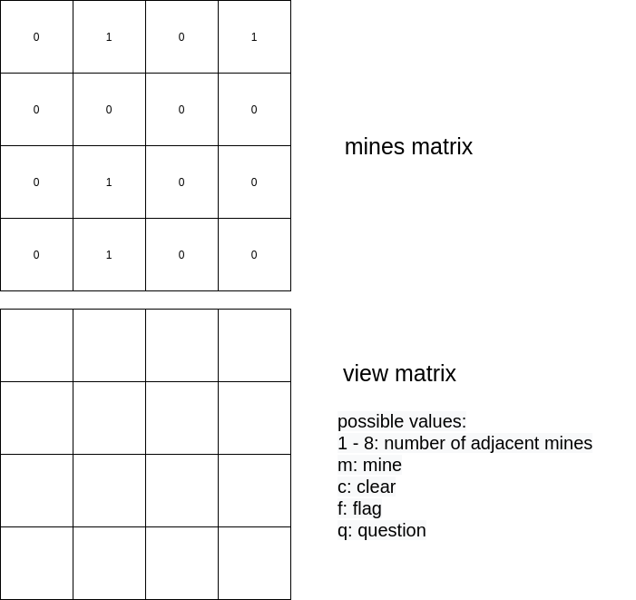
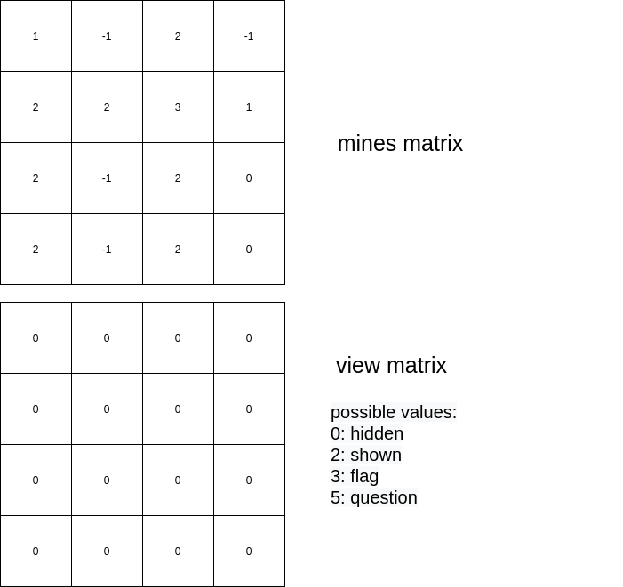

# Thinking process

This file follows my thinking process during this project's development; here, I will describe the ideas and decisions I made.

# Day 1

## Topic research

First, I reviewed the [Wikipedia](<https://en.wikipedia.org/wiki/Minesweeper_(video_game)>) article of the game provided by the client and two youtube [videos](https://youtu.be/7B85WbEiYf4) explaining how to play the game; an important fact is that:

- "The first click in any game will never be a mine."

So the placement of mines in the game board must be after the first play and not before.

## Game design

My first idea was that the backend service must store two representations of the game board; the first one will hold the game solution, I will call it _mines matrix_. The second representation will store the game board's current state; I will call it _view matrix_.

The train of thought behind this is that the software client will never know the _mines matrix_ as it is the game's solution, so no cheating is possible. And the _view matrix_ allows the software client to draw the current state of the game.



The backend will receive a play from the user, review the stored _mines matrix_, update the _view matrix_ following the game rules, and return the new game state (_view matrix_) to the client.

### Update

An issue in my first design was that with every play sent, the backend must compute the number of adjacent mines in the cells revealed by the user. Still, those numbers are constant along the game, so they can be calculated one time only and stored.


The _view matrix_ can be seen as a mask for the _mines matrix_. So at the beginning of the game, the 0's hide the numbers from the _mines matrix_.

An additional fix for the view matrix is to replace the characters representing the flag and the question sign with numbers, so it can be easily applied as a mask by element-wise product.



I decided to use prime numbers for the view matrix as it provides an easy way to pinpoint if the result of the product-wise product is a flag or a question sign (e.g., if the cell can be divided by 3, it is a flag).

## API design

One of the client's requirements is the ability to support multiple users, so the API must be able to register user accounts. For this task, a minimum of 4 endpoints must be available:

```
POST /users                  <-- register a new user account.
POST /users/login            <-- login with a user account (returns a JWT token to validate the user's identity).
POST /users/recover-password <-- request a password reset.
POST /users/password         <-- set the password from the requested reset.
```

To resume old games, it necessary to list them, so a read endpoint for all the user's games is required:

```
GET /games/minesweeper/sessions            <-- list all minesweeper game sessions.
GET /games/minesweeper/sessions/:sessionId <-- read a minesweeper game session.

```

I'm going to "/minesweeper" in the path. If I develop another game in the future, I only have to change the path to "/:game" to make a generic endpoint.

Then, an endpoint to create a new game is also required:

```
POST /games/minesweeper/sessions <-- create a minesweeper game session.

```

Finally, an endponit to play a specific minesweeper game is required:

```
POST /games/minesweeper/sessions/:sessionId <-- create a play in a minesweeper game session.

```

This endpoint was a tricky one, as one can argue that another HTTP verb should be used to "modify" the game resource (PUT, PATCH). Still, to be idempotent, a PUT request made several times with the same parameters must return the same result, which cannot be true for all games (thinking of a generic game API).

## Deployment environment

I will deploy the REST API's backend with _AWS Lambda_ (with _Amazon API Gateway_) as its free tier provides 1 Million free requests per month. And it will ensure that the API is easily scalable, so if our game is a hit, we'll be able to withstand high demand.

For data persistence, I'm going to use _Amazon DynamoDB_ for two reasons; the first one is that it is a document-based non-SQL database. So if we develop another game in our API, we will not fight with database schemas. The second reason is cost, as it provides a 25 GB free tier.

I'll be using the [serverless](https://www.serverless.com) framework for the development. It provides an easy way to define the _AWS_ resources architecture with a single YAML file.
